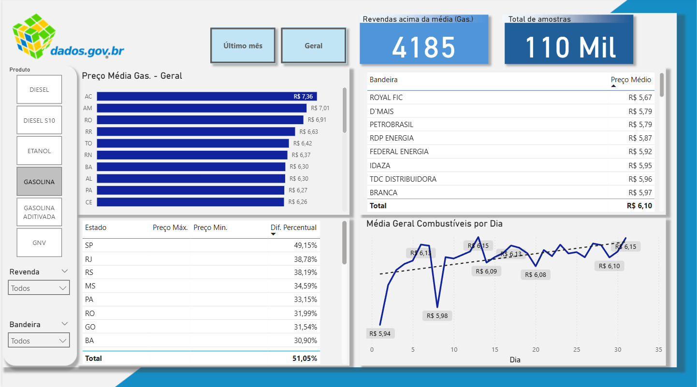
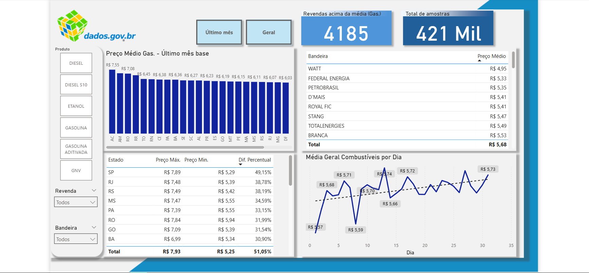

# Análise dos Preços de Combustíveis no Brasil.

O projeto visa a análise de dados para responder algumas perguntas sobre os preços de combustíveis no país. A fonte de dados traz informações do o segundo semestre de 2024.

# 
Análise sobre o preço de combústiveis

## Perguntas realizadas antes da análise
- Qual foi o preço médio de venda da gasolina comum por estado no último mês da base?
- Quantas revendas vendem gasolina acima da média nacional?
- Qual bandeira teve o menor preço médio por tipo de combustível?
- Qual é a diferença percentual entre o maior e o menor preço praticado de diesel em cada estado?
- Qual o comportamento de preços ao longo do tempo por tipo de combustível?
- Qual é o estado com o maior preço médio da Gasolina Comum?
- Quantas amostras foram realizadas em todo o período?
- Os preços tendem a serem maiores em qual período do mês?

Desenvolvi medidas em DAX para análise de preço médio, variação percentual, comportamento temporal e comparações por estado, bandeira e tipo de combustível

## 🧰 Tecnologias Utilizadas
- Microsoft PowerBI 
- Power Query
- DAX

##  📁 Fontes de Dados
Os dados utilizados são oriundos do Portal de Dados Abertos em parceria com a ANP(Agência Nacional do Petróleo, Gás Natural e Biocombustíveis). Para acessá-los [clique aqui](https://dados.gov.br/dados/conjuntos-dados/serie-historica-de-precos-de-combustiveis-e-de-glp).

O arquivo `Preços semestrais - AUTOMOTIVOS_2024.02.xlsx` contém todas as informações do nosso dataset. É importante dizer que antes da análise ele foi tratado para atender a modelagem de dados no formato Star Schema.

## Resultados do Dashboard

### Média Geral da Gasolina

### Preço Médio no Último Mês de Todos os Combustíveis

